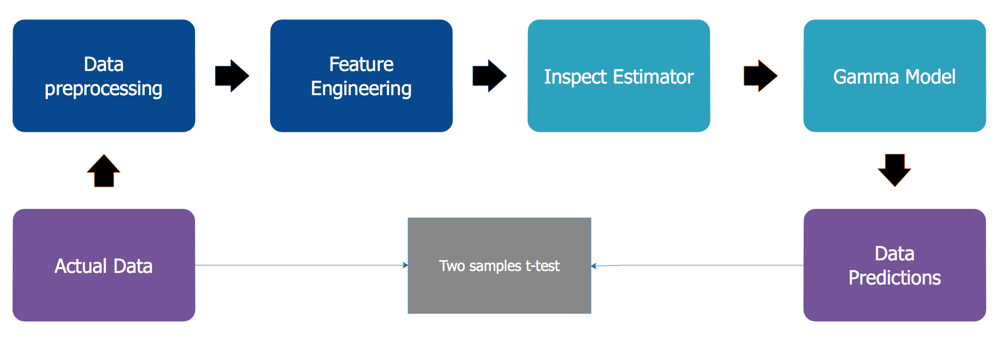
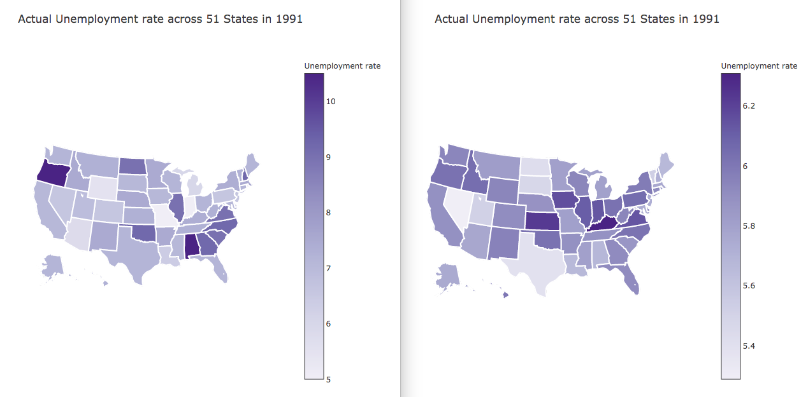

# Unemployment of Blue Collar Workers Modeling

## Description

- A cross-section from 1982

- Number of observations : 4877

- Observation : individuals

- Country : United States

## Usage

1. Data(Benefits)

## Format

A time serie containing :

* **stateur**: state unemployment rate (in %)
* **statemb**: state maximum benefit level
* **state**: state of residence code
* **age**: age in years
* **tenure**: years of tenure in job lost
* **joblost**: a factor with levels (slack\_work,position\_abolished,seasonal\_job\_ended,other)
* **nwhite**: non-white ?
* **school12**: more than 12 years of school ?
* **sex**: a factor with levels (male,female)
* **bluecol**: blue collar worker ?
* **smsa**: lives is smsa ?
* **married**: married ?
* **dkids**: has kids ?
* **dykids**: has young kids (0-5 yrs) ?
* **yrdispl**: year of job displacement (1982=1,..., 1991=10)
* **rr**: replacement rate
* **head**: is head of household ?
* **ui**: applied for (and received) UI benefits ?

## Source

McCall, B.P. (1995) “The impact of unemployment insurance benefit levels on recipiency”, Journal of Business and Economic Statistics, 13, 189–198.

## References

Verbeek, Marno (2004) A Guide to Modern Econometrics, John Wiley and Sons, chapter 7.

Journal of Business Economics and Statistics web site : http://amstat.tandfonline.com/loi/ubes20.

## Gamma Modeling

* Maximum Likelihood Estimation(MLE):

$$ L(\alpha, \beta) = \sum_{i=1}^{n} \log \big( p_{\alpha, \beta}(x_i) \big) = (\alpha-1) \sum_{i=1}^n \log(x_i) - \frac{1}{\beta} \sum_{i=1}^{n}x_i - n\alpha \log(\beta) - n\log( \Gamma(\alpha) ) $$

$$ ^\text{max}_{\beta,\beta_0} - \dfrac {1} {N} \sum_{i=1}^{N} \dfrac {y_i} {x{^T_i}\beta + \beta_0} + \text{log} \big( x{^T_i}\beta + \beta_0 \big ) - \lambda \Big( \alpha||\beta||_1 + \dfrac {1} {2}(1 - \alpha)||\beta||^2_2 \Big) $$

## Links

As indicated previously, a link function gg:$$ E(y)=μ=g−1(η)E(y)=μ=g−1(η) $$ relates the expected value of the response μμ to the linear component ηη. The link function can be any monotonic differentiable function. This relaxes the constraints on the additivity of the covariates, and it allows the response to belong to a restricted range of values depending on the chosen transformation gg.

H2O’s GLM supports the following link functions: Family_Default, Identity, Logit, Log, Inverse, and Tweedie.

The following table describes the allowed Family/Link combinations.